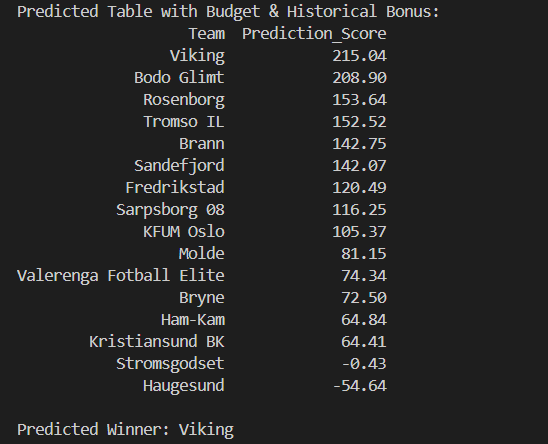

# Eliteserien Winner Prediction

## Description  
This project predicts the winner of the Norwegian football league (Eliteserien) by combining match statistics (this season), team budgets(current), and historical championship data(2010-2024).Prediction was made today (03/08/2025) with 13 matchdays left. 

## Project Structure  
- `src/` : Python code that loads the data from CSV files, performs calculations based on team performance so far, and makes predictions for this season's Eliteserien winner.  
- `data_xlsx/` : Original Excel files (Last_Champions.xlsx, Eliteserien_Dataset.xlsx).  
- `data_csv/` : The same data in CSV format for easier loading with pandas.
- `images/` : Images used in this project.  
- `README.md` : This file.  
- `requirements.txt` : List of Python libraries required to run the project.

## Screenshots



## Installation & Usage  
1. Clone the repository:  
```bash
git clone https://github.com/timosvar/Eliteserien_Winner_Prediction.git
cd Eliteserien_Winner_Prediction
```

## Install the required libraries

```bash
pip install -r requirements.txt
```

## Run the prediction code

```bash
python src/prediction.py
```

## Future Improvements

- Develop detailed visual dashboards and interactive reports using Power BI to better analyze team performance and prediction results.
- Add machine learning models for more accurate predictions.
- Improve data handling with automatic updates and cleaning.
- Integrate live results API when available.


## Notes

- No API keys or sensitive information are included.
- All paths are set to work locally with the provided files.